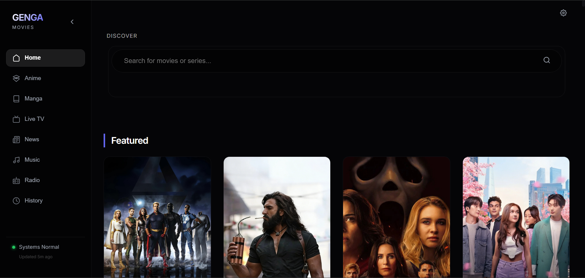
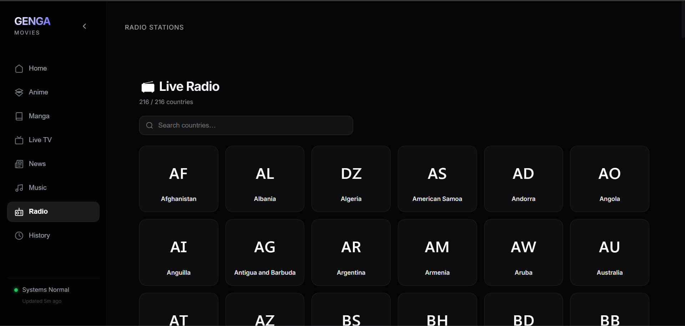
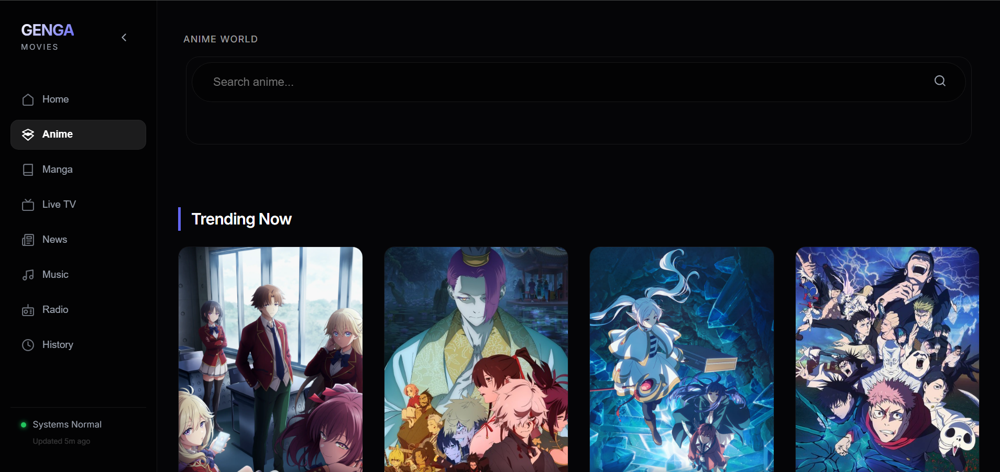
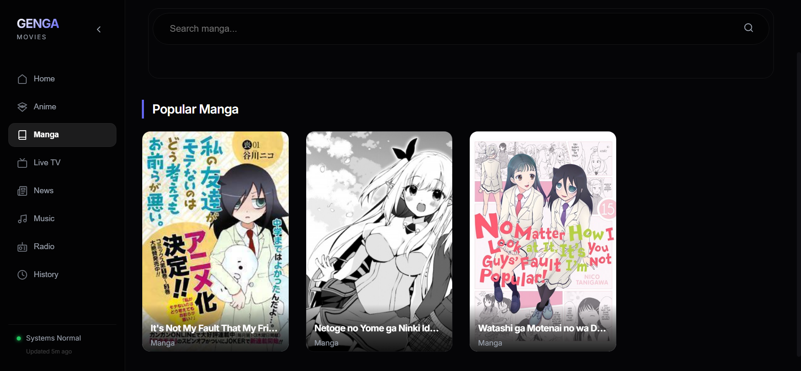
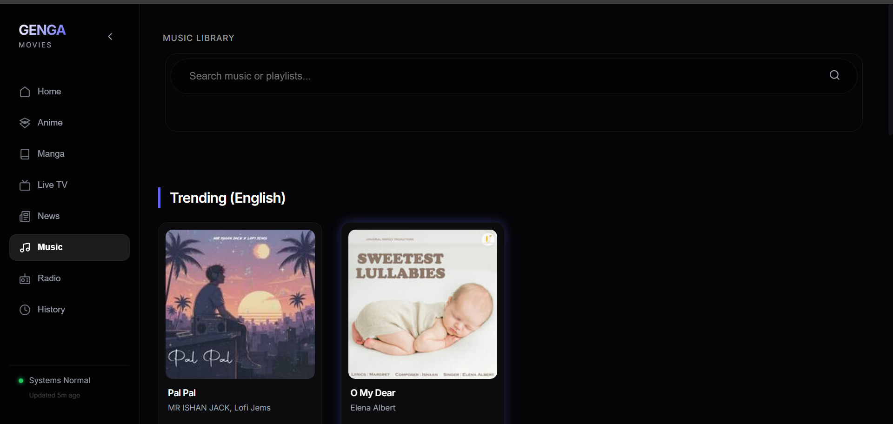
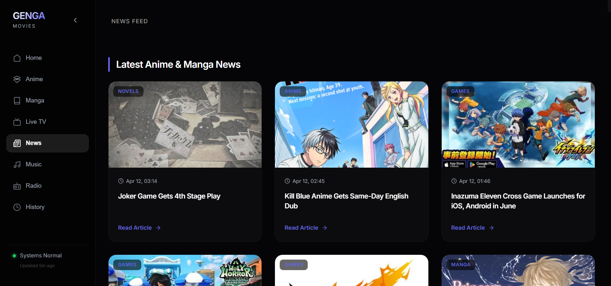
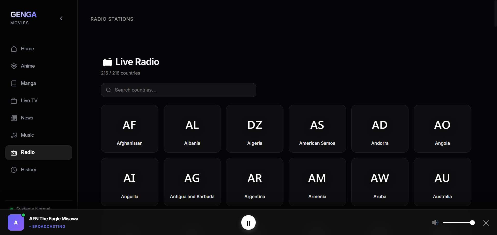

#  GENGA MOVIES App

**Genga Movies App** is a self-hosted web interface for aggregating metadata and controlling media playback. It connects to external APIs to resolve stream URLs and provides a unified frontend for search and discovery.

---

## 🎯 Project Scope

### What this is
-   A **metadata aggregator** that pulls info from MovieBox, Anilist & MegaPlay, and YTS.
-   A **playback controller** that delegates streaming to embedded players or local proxies.
-   A **technical demonstration** of FastAPI and React integration.

### What this is not
-   A content hosting platform.
-   A video distribution service.
-   A commercial product.

---

## ✨ Key Features

### Navigation & UI
-   **Unified Sidebar**: Vertical navigation for switching between standard, anime, manga, and news sources.
-   **Source Filtering**: Dedicated views for **Movies**, **Anime**, **Manga**, **Music**, **News**, **Live TV**, and **Radio**.
-   **In-App News Reader**: Read full anime/manga articles directly within the app using a premium glassmorphic reader.
-   **Instant Back Navigation**: State-merging logic ensures posters and metadata persist when returning from the player or reader.
-   **Loading UI**: High-contrast global loading spinner with silent background updates.

### Playback & Downloads
-   **Subtitle Selection**: Premium subtitle menu with language selection and status toggle. Preferences (ON/OFF and Language) persist in `localStorage`.
-   **Direct Video Download**: Download movies and series directly as `.mp4` files. No server-side zipping, just pure stream proxying.
-   **HLS Proxying**: Advanced proxying of M3U8 segments and on-the-fly SRT to VTT conversion for broad device compatibility.
-   **CineCLI Integration**: Searches decentralized networks (YTS) with automatic magnet link resolution.

---

## 📸 Section Screenshots

*Visual overview of the application components.*

| Section | Preview |
| :--- | :--- |
| **Home / Discovery** |  |
| **Live TV** |  |
| **Live Radio** |  |
| **Anime (Anilist & MegaPlay)** |  |
| **Manga (Scans)** |  |
| **Music (GaanaPy)** |  |
| **News (ANN Feed)** |  |

---

## 📺 Premium Media Experience

*Feature-rich playback and reading with subtitles, episode management, and immersive readers.*

| Feature | Screenshot |
| :--- | :--- |
| **Anime Player** |  |
| **Home player** |  |
| **Live TV Player** |  |
| **Radio Player** |  |
| **Manga Reader** |  |
| **News Reader** |  |
| **Music Player** |  |

---


## 🧰 Tech Stack

**Backend**
-   **FastAPI**: Async Python web framework.
-   **HTTPX**: Asynchronous HTTP client.
-   **Uvicorn**: ASGI server implementation.

**Frontend**
-   **React 18**: Frontend library.
-   **Vite**: Build tool and dev server.
-   **CSS Modules**: Component-scoped styling.

---

## 🧠 Architecture & Workflows

### 1. General Movies & Series
*High-quality metadata and direct HTTP streaming.*
-   **How it works**: Combines metadata from TMDB with direct stream links from indexed file hosts.
-   **Stream Button**: Resolves the direct MP4/MKV link and plays it in the integrated player.
-   **Download Button**: Routes the request through the **Backend Download Proxy** (`/api/proxy/download`). This creates a tunnel, allowing you to download files even if the host blocks direct browser downloads (CORS/Referer protection).
-   **Local vs Cloud**:
    -   **Local Mode**: Frontend talks to your running `localhost:8080` server. Recommended for maximum speed and proxy capabilities.
    -   **Cloud Mode**: Frontend connects to a public community instance. Useful if you can't run Python locally.

### 2. Anilist & MegaPlay (Anime)
*Specialized Anime scraper.*
-   **How it works**: Scrapes episode lists and IDs from Anilist & MegaPlay.
-   **Stream Button**: Instead of a direct file, it loads a third-party **Embed Player** (iframe) inside the app. This ensures 99% availability for anime episodes without complex proxying.

### 3. Manga (Scans)
*Dedicated Manga discovery and reading.*
-   **How it works**: Aggregates manga titles and chapter lists from global databases (Consumet/Mangapill).
-   **Reader**: Integrated image-based reader with **Next/Previous Chapter** navigation and automatic page preloading.
-   **Downloads**: Facilitates direct ZIP downloads of chapters for offline reading.

### 4. Music (Streaming)
*Integrated music playback with chart and playlist support.*
-   **How it works**: Uses the GaanaPy API to search for songs, albums, and popular charts.
-   **Charts & Playlists**: Browse "Hindi Top 50" and other regional charts with full tracklist selection.
-   **Playback**: Direct high-quality streaming links provided by Gaana servers.

### 5. Live TV (Streaming)
*Global TV channels driven completely by the frontend.*
-   **How it works**: The app fetches country and channel metadata directly from the public GitHub repository of Famelack (`famelack-channels`) avoiding any backend API overhead.
-   **Playback (IPTV)**: Standard `.m3u8` links are played natively in the browser using an integrated, low-latency customized `HLS.js` configuration.
-   **Playback (YouTube)**: YouTube live streams bypass iframe restrictions by using the official **YouTube IFrame API** (`YT.Player`). This ensures maximum compatibility for channels that block standard embeds.

### 6. News (Feed)
- 📰 **News Feed:** Stay updated with the latest in anime, movies, and games via combined RSS feeds.
### 7. Live Radio
- **How it works**: Fetches live broadcasts from the Famelack radio dataset.
- **Background Player**: Specialized background audio player allows listening while browsing other sections.

---

---

## 8. Setup & Usage

### Prerequisites
-   Python 3.8+
-   Node.js 16+

### 1. Backend
```bash
cd backend
pip install -r requirements.txt # or install manually: fastapi uvicorn httpx moviebox-api
python -m uvicorn main:app --host 0.0.0.0 --port 8080 --reload
```
*Documentation available at: [http://localhost:8080/docs](http://localhost:8080/docs)*

### 2. Frontend
```bash
cd frontend
npm install
npm run dev -- --host
```
*Access application at: `http://localhost:5173`*

---

## ⚙️ Configuration & URLs

### 1. External Service APIs (Backend)
If you are running the backend locally and wish to change where it pulls data from (e.g., if a provider URL changes), update these files:

| Service | Location | Variable | Current URL |
| :--- | :--- | :--- | :--- |
| **Music (GaanaPy)** | `backend/music_service.py` | `self.base_url` | `https://gaanapy-a8jf.onrender.com` |
| **Manga (Consumet)** | `backend/manga_service.py` | `BASE_URL` | `https://api-consumet-org-x46x.onrender.com` |
| **News (ANN)** | `frontend/src/App.jsx` | - | `https://api-consumet-org-x46x.onrender.com` |

### 2. Cloud vs Local Routing (Frontend)
The application uses a hybrid routing model defined in `frontend/src/App.jsx`.

#### **The `CLOUD_BASE` URL**
The variable `CLOUD_BASE` (currently `http://localhost:8000`) acts as a hosted instance of the Genga backend. This is used as a reliable fallback.

#### **How to Replace the Cloud URL**
If you want to use your own hosted backend instead of the default one:
1. Open `frontend/src/App.jsx`.
2. Locate the line: `const CLOUD_BASE = 'http://localhost:8000';`.
3. Replace the string with your own server URL (make sure it doesn't end with a slash).

#### **Source-Specific Routing Logic**
In `App.jsx`, the variable `API_BASE` determines which backend the frontend talks to for a specific section:

```javascript
// App.jsx logic
const API_BASE = (activeSource === 'anilist' || activeSource === 'manga' || activeSource === 'music' || activeSource === 'news')
    ? CLOUD_BASE
    : localServerURL;
```

- **Cloud-Routed (Anime, Music, Manga, News)**: These sections are hard-coded to use `CLOUD_BASE` or the direct API endpoint (for News). This ensures that even if you don't have the Python backend running locally, these specialized scrapers continue to function.
- **Local-Routed (Home, Movies, CineCLI)**: These sections use your `localServerURL` (detected as `localhost:8080` by default). This is necessary for CineCLI (torrents) and direct movie proxies which rely on your local machine's network.

### 3. How it Works (Data Flow)
1. **User Action**: You click on a Manga, Music, or News item.
2. **Frontend Request**: Since the source is `manga`, the frontend sends the request to `http://localhost:8000/api/manga/...` (or directly to the News API).
3. **Cloud Backend**: The hosted backend receives the request.
4. **Provider Fetch**: The Cloud backend then talks to the actual provider (like Consumet or GaanaPy).
5. **Data Return**: The data travels back to your browser.

This path bypasses the need for you to host the complex scraping logic locally for these specific sources.


## 🔁 Client-side Routing (Deep Links)

The frontend is a single-page React application that uses React Router for navigation. By default the app is shipped with a hash-based router (`HashRouter`) so deep links work when hosting the built files on simple static servers or via preview services.

Key routes
- `/` — Home / Discover view
- `/details/:id?source=<source>` — Item details modal (source defaults to `home`). Example: `/#/details/dispatches-from-elsewhere?source=home`
- `/watch/:id?season=<n>&episode=<m>` — Watch page for a given item. Example: `/#/watch/some-id?episode=1`

Notes
- The watch page syncs the currently selected `season` and `episode` into the URL query string so you can copy/paste or bookmark an exact player state.
- `HashRouter` is used intentionally for compatibility with static hosting. If you prefer clean URLs (no `#`), switch to `BrowserRouter` and configure your server to return `index.html` for unknown paths (SPA fallback).

Testing deep links locally
1. Run the frontend dev server:
```bash
cd frontend
npm run dev
```
2. Open a deep-link in the browser (Vite dev server also serves hash routes):
```text
http://localhost:5173/#/watch/<ITEM_ID>?episode=1
```

Programmatic navigation
- The app uses `useNavigate()` from `react-router-dom` for internal navigation and replaces history entries when updating episode/season so the back button remains intuitive.


This software is for educational and research purposes only. The developers of this project do not host, own, or upload any media content. The application acts solely as a client-side interface for existing third-party APIs. Users are responsible for ensuring their usage complies with all applicable local laws and regulations.

## 📄 License

Licensed under the **AGPL-3.0**. See `LICENSE` for details.
